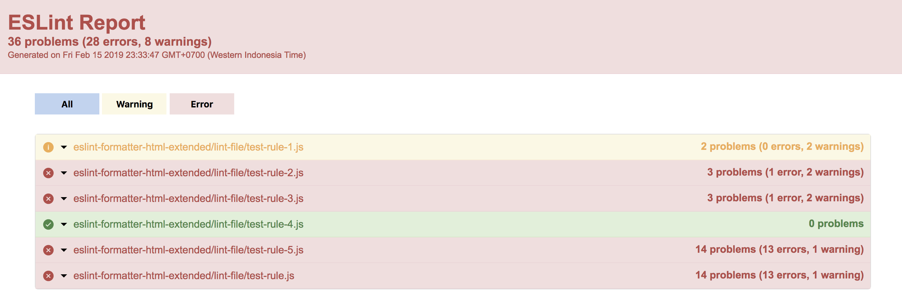
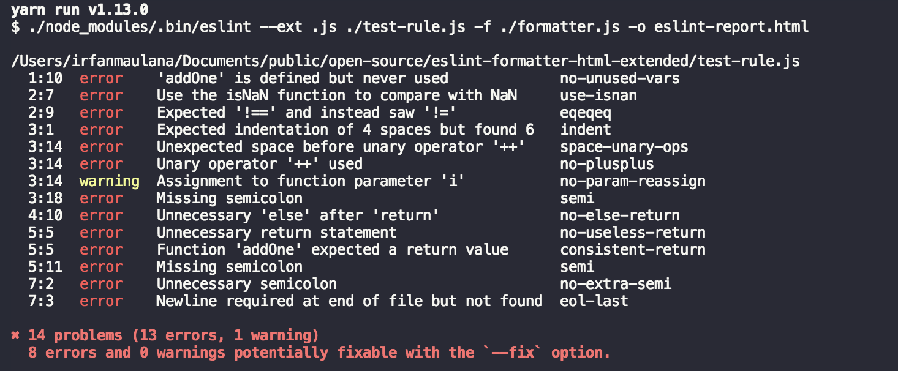

# eslint-formatter-html-extended

🌹 Beautiful ESLint HTML formatter extended from ESLint's official HTML formatter by [JulianLaval](https://github.com/JulianLaval) combined with Stylish by [Sindre Sorhus](https://github.com/sindresorhus)

[](https://github.com/mazipan/eslint-formatter-html-extended) [](https://www.npmjs.com/package/eslint-formatter-html-extended)
[](https://www.npmjs.com/package/eslint-formatter-html-extended) 

## Why you need this formatter

With this formatter, you can generate HTML as report but still can see output in your terminal.

Read the background story:

+ [in Bahasa Indonesia](https://mazipan.space/eslint-formatter-html-extended/?utm_source=readme)
+ [in English](https://mazipan.space/en/eslint-formatter-html-extended/?utm_source=readme)

## Output Report

[preview here](http://htmlpreview.github.io/?https://github.com/mazipan/eslint-formatter-html-extended/blob/master/eslint-report.html)

## Screenshoot





## Installation

```bash
$ yarn add eslint-formatter-html-extended -D
# OR
$ npm i eslint-formatter-html-extended --dev
```

## Usage

Refer to this [docs](https://eslint.org/docs/user-guide/formatters/), you just need to add parameter `-f nameFormatter -o nameFile`, e.g.:

```bash
eslint --ext .js . -f node_modules/eslint-formatter-html-extended -o eslint-report.html
```

Or with shortcut name

```bash
eslint --ext .js . -f html-extended -o eslint-report.html
```

## Development

```bash
# install dependencies
$ yarn install

# generate new output report
$ yarn lint:test
```


---

Copyright © 2019 by Irfan Maulana

